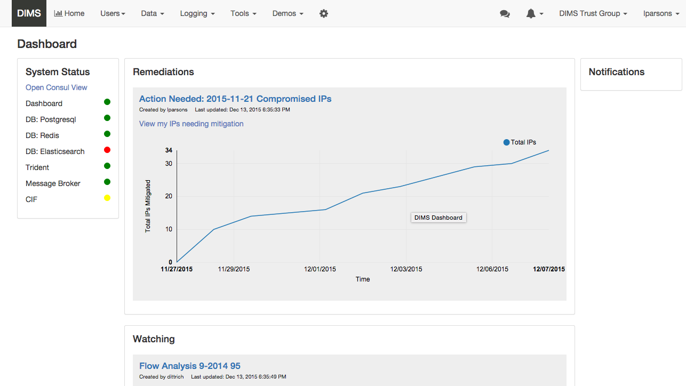

.. _usingthedashboard:

Using the Dashboard
===================

This section will introduce basic usage of the DIMS Dashboard.

Currently this section contains a demo of the dashboard with commentary. The following
sub-sections will go through:

#. Mitigation Scenario
#. System health
#. Live log streaming
#. Chat
#. User display and trust group info - show users by trust group

..

The demo application is not currently using https, so you won't need to worry about
certificates when logging in. Make sure you are logged out of the dashboard
(if you are already logged in) and reload the login page if you are already
on that page (to make sure your client has the latest version).

Mitigation Scenario
-------------------

Go to ``demo.prisem.washington.edu`` and log in using your ``ops-trust`` username
and password.

The main dashboard will display.

..

**Remediations** are mitigation activities in the system where the logged in
user (lparsons in the screenshots) has IPs that are compromised and
need to be remediated.
Currently, the system contains one of these
"Mitigation scenario" activities which was bootstrapped programmatically.

**Hover over the graph to display data points.** Note the number of mitigated IPs
at the most recent data point (the dates may differ than that in the
screenshot):

..

Click **View my IPs needing mitigation** link to display a modal window where you can
submit IPs that have been mitigated. Right now, the UI for this consists of the modal
displaying all remaining IPs you need to address.

..

This mitigation activity has IPs that need to be remediated for the users
dittrich, lparsons, mboggess, and swarner. So your IPs will look different
than those in this figure.

..

**Check off some IPs indicating that they have been mitigated** and click *Submit*.

..

The modal window will close and the graph will be updated. Hover over the
last data point to verify. For this user, the total IPs mitigated is now 39.

..

.. note::

   Currently, to start a new mitigation activity, a user will do so via the
   Dashboard (UI not available yet), using a form to submit the suspect IPs
   that the user probably received on a Trident email list.  The system then automatically
   parses the list and bins the IPs according to attributes belonging
   to users, creating a new activity that will appear in the Remediations list for
   those users that are affected. There will also be some sort of notification.
   (In the future this creation would be automated by a service that can process
   emails that come into the system.)

..

The **Watching** section lists Activities that the user has subscribed to, either by
subscribing to a public activity created by someone else or by creating a new
activity.

..

Activities are collections of data, queries, etc. They can be public or
private.  If a user subscribes to a public activity, the user receives a notification
when new data is added to the activity. This is a first cut at the UI, and most of the
UI display/functions (creating, sharing, subscribing) are currently in progress and
not online
(server side API and associated modules exist). The only thing you can see right
now in the UI is the list of activities.

..

System health
-------------

The status area on the left is mostly static at present. However, a link to open
the consul UI in a new tab exists.

Click **Open Consul view**:

..

and the Consul UI will open in a new tab with the
**NODES** tab selected.

..

Live log streaming
------------------

The live log monitoring is now a popup panel so as
to persist data across page views.
That means the buffers won't be cleared if you go to a different section on the
site (e.g. new page load).

1. Click **Logging** in the Navigation bar and select **Live log streaming**.

   .. figure:: demo/logmon1.png
      :width: 100%
      :align: center

   ..

   The Live log streaming window anchored to the bottom of the browser window will display.

   .. figure:: demo/openstreaming.png
      :width: 100%
      :align: center

   ..

   There are tabs for the log exchanges the server monitors. Each tab has a button to turn on and
   turn off that particular log monitor. The user can clear the buffer using the *Clear* button.
   The user can hide the window by clicking the minimize button (down arrow in title bar),
   and then maximize it by
   clicking the maximize button (up arrow).  Clicking the close button (X) turns off all monitors and
   closes the window. The window can also be closed by clicking **Logging > Live log streaming**
   in the Nav bar.
   (This is  a toggle - if the window is active, clicking it closes the window. If the
   window is closed, clicking the button opens the window.)

   The *Live log streaming* window, like the *Chat* window, is independent of other page views.
   So it will remain active even if you go to a different view via a menu or
   navigation button.

2. Click on **Devops** tab and click button **Turn on Devops**

   .. figure:: demo/logmon2.png
      :width: 100%
      :align: center

   ..

   .. figure:: demo/logmon3.png
      :width: 100%
      :align: center

   ..

3. Do the same for Health - click on Health tab and click button **Turn on Health**

4. You could start an activity that reports to devops via another program, or wait a
   couple minutes and you’ll probably get info on Health:

   .. figure:: demo/healthlog1.png
      :width: 100%
      :align: center

   ..

5. Click the minimize button:

   .. figure:: demo/minimize.png
      :width: 100%
      :align: center

   ..

   and the logs will minimize to the bottom of the window.

6. Then click maximize to open it again.

   .. figure:: demo/maximize1.png
      :width: 100%
      :align: center

   ..

   The messages will still be there (maybe more).

   .. figure:: demo/maximize2.png
      :width: 100%
      :align: center

   ..

   You can go to different locations in the app without clearing the log buffers. So go to
   **Users > Find DIMS users** to display users in your current trust group. The
   users will display behind the streaming window. Minimize the streaming log display
   to view the users:

   .. figure:: demo/minimize2.png
      :width: 100%
      :align: center

   ..

7. You can clear the log buffers individually by clicking **Clear** in a log tab.
   To clear all the buffers and close the display, click the **Log Monitor** link in
   the nav bar or just click the **X** in the monitor window title bar.

..

Chat
----

1. Click the chat icon in the Nav bar to open the chat window:

   .. figure:: demo/clickchaticon.png
      :width: 100%
      :align: center

   ..

   Unless you’re
   chatting with someone else who is logged in, there isn’t much to see (you can send messages to yourself however). Enter a message in the message area of the chat box and press **Enter** key.

   .. figure:: demo/chat1.png
      :width: 50%
      :align: center

   ..

   The message you sent will appear in your chat window:

   .. figure:: demo/chat2.png
      :width: 50%
      :align: center

   ..

..

User display and trust groups
-----------------------------

1. Note that the name of the trust group you are logged into displays on the menu
   bar:

   .. figure:: demo/tginnavbar.png
      :width: 100%
      :align: center

   ..

   The system remembers your last selection. If you have never selected a trust group,
   it will choose the first one in your list of trust groups when you first log in.

2. Display your profile information by selecting ``lparsons > Profile`` in the nav bar.
   Note that the trust group info now displays in the profile.

   .. figure:: demo/dimstrustgroupinprofile.png
      :width: 100%
      :align: center

   ..

3. Change your trust group by clicking on the current trust group in the nav bar and
   selecting an option that displays in the menu. (If you are only in one trust group
   then no options will display.)

   .. figure:: demo/changetrustgroup1.png
      :width: 100%
      :align: center

   ..

4. Note that the trust group listed in your profile will change to the current
   trust group:

   .. figure:: demo/maintrustgroup.png
      :width: 100%
      :align: center

   ..

5. To see the users in your currently selected trust group, select
   ``Users > Find DIMS Users`` on the nav bar. The list of users in the current trust
   group will display.

6. Again, change the trust group via the trust group menu in the nav bar. The list of
   users will change to reflect the users in the new current trust group.

   .. figure:: demo/changetodims.png
      :width: 100%
      :align: center

   ..

